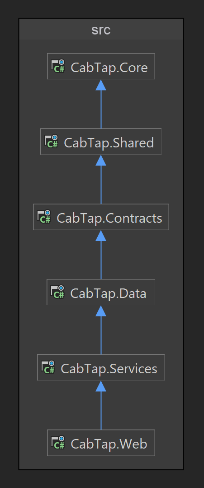

# CabTap

CabTap is a taxi reservation system built with ASP.NET Core.

## Table of Contents

- [Overview](#overview)
- [Features](#features)
- [Getting Started](#getting-started)
  - [Prerequisites](#prerequisites)
  - [Installation](#installation)
- [Usage](#usage)
- [Folder Structure](#folder-structure)
- [Technologies Used](#technologies-used)
- [Contributing](#contributing)
- [License](#license)

## Overview

CabTap is a web application that provides users with a reliable and efficient taxi reservation system, designed to be user-friendly and easy to use.

## Features
- Users can enjoy features such as address autocompletion, viewing the distance and cost of their trip, choosing a taxi type and more when creating reservations!
- Users can see their reservation history.
- Admins can see and manage reservations, as well as access other important information conveniently.

## Getting Started

### Prerequisites

- [.NET Core SDK](https://dotnet.microsoft.com/en-us/download/dotnet/6.0)

### Installation

1. Clone the repository:

```bash
git clone https://github.com/VeselinTodorovv/DiplomenProekt.git
```

2. Navigate to the project directory:

```bash
cd CabTap
```

3. Restore dependencies and build the project:

```bash
dotnet build
```

4. Run the Web App:

```bash
dotnet run
```

## Usage

- Visit the application in your web browser.
- Log in or register an account.
- Explore the features available to you!

## Project Architecture

This is an overview of the project's architecture. Each layer is dependent on those above.

## Technologies Used

#### Back end:
- C#
- ASP.NET Core MVC
- SQL Server

#### Front end:
- HTML, CSS
- Razor, Bootstrap
- JavaScript, jQuery, LeafletJS

## License
This project is licensed under the [MIT License](LICENSE).