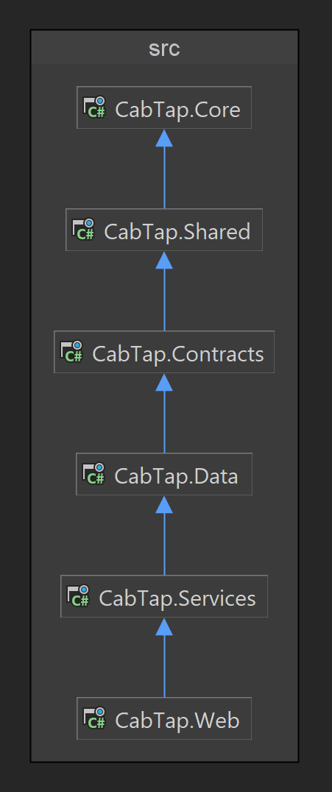

# CabTap

CabTap is a modern, user-friendly taxi reservation system built with ASP.NET Core.

## Table of Contents

- [Overview](#overview)
- [Features](#features)
- [Getting Started](#getting-started)
    - [Prerequisites](#prerequisites)
    - [Installation](#installation)
- [Usage](#usage)
- [Project Architecture](#project-architecture)
- [Technologies Used](#technologies-used)
- [Database Configuration](#database-configuration)
- [Contributing](#contributing)
- [License](#license)

## Overview

CabTap is a web application that provides users with a reliable and efficient taxi reservation system. Designed with user experience in mind, it offers seamless booking, real-time calculations, and comprehensive admin management capabilities.

## Features

- **Smart Address Autocompletion** - Google Maps integration for easy location selection
- **Real-time Trip Calculations** - View distance and cost estimates before booking
- **Taxi Type Selection** - Choose from various vehicle options based on your needs
- **Reservation History** - Track and manage your past and upcoming trips
- **Admin Dashboard** - Comprehensive management interface for reservations and system monitoring
- **User Authentication** - Secure login and registration system

## Getting Started

### Prerequisites

- [.NET 6.0 SDK](https://dotnet.microsoft.com/en-us/download/dotnet/6.0)
- [Docker](https://www.docker.com/products/docker-desktop) (for database container)
- [PostgreSQL](https://www.postgresql.org/download/) (optional, if not using Docker)

### Installation

1. **Clone the repository:**

```bash
git clone https://github.com/VeselinTodorovv/DiplomenProekt.git
cd DiplomenProekt/CabTap
```

2. **Set up the database environment variable:**

```bash
# Set the database password (replace 'your_password' with your actual password)
export DB_PASSWORD=your_password
# Or on Windows:
# set DB_PASSWORD=your_password
```

3. **Start the PostgreSQL database with PostGIS extension using Docker:**

```bash
docker run --name cabtap-db -e POSTGRES_PASSWORD=$DB_PASSWORD -e POSTGRES_DB=cabtap -p 5432:5432 -d postgis/postgis:latest
```

4. **Restore dependencies and build the project:**

```bash
dotnet restore
dotnet build
```

5. **Apply database migrations:**

```bash
dotnet ef database update
```

6. **Run the application:**

```bash
dotnet run
```

7. **Open your browser and navigate to:** `https://localhost:7000` or `http://localhost:5000`

## Usage

- Visit the application in your web browser
- Register a new account or log in with existing credentials
- Use the booking interface to:
    - Enter pickup and destination locations with autocomplete
    - Select preferred taxi type
    - View calculated distance and fare
    - Confirm your reservation
- View your reservation history in the dashboard
- Admins can access the admin panel to manage all reservations and system data

## Project Architecture



The application follows a layered architecture pattern:

- **Presentation Layer** - ASP.NET Core MVC with Razor views
- **Business Logic Layer** - Application services and domain logic
- **Data Access Layer** - Entity Framework Core with repository pattern
- **Database Layer** - PostgreSQL with PostGIS extension for spatial data

## Technologies Used

### Backend
- **C#** - Primary programming language
- **ASP.NET Core MVC** - Web application framework
- **Entity Framework Core** - ORM for database operations
- **PostgreSQL** - Relational database system
- **PostGIS** - Spatial database extension for geographic data
- **Docker** - Containerization for database deployment

### Frontend
- **HTML5, CSS3** - Markup and styling
- **Bootstrap** - Responsive UI framework
- **Razor Pages** - Server-side templating
- **JavaScript, jQuery** - Client-side interactivity
- **LeafletJS** - Interactive maps, Geocoding and place autocomplete

## Database Configuration

The application uses PostgreSQL with PostGIS extension for spatial data capabilities. Key configuration details:

- **Database**: PostgreSQL with PostGIS extension
- **Connection**: Configured via environment variable `DB_PASSWORD`
- **Spatial Support**: PostGIS enables geographic calculations for distance and routing
- **Containerization**: Docker deployment for easy setup and consistency

To update the database schema after changes:
```bash
dotnet ef migrations add [MigrationName]
dotnet ef database update
```


## License

This project is licensed under the MIT License - see the [LICENSE](LICENSE) file for details.